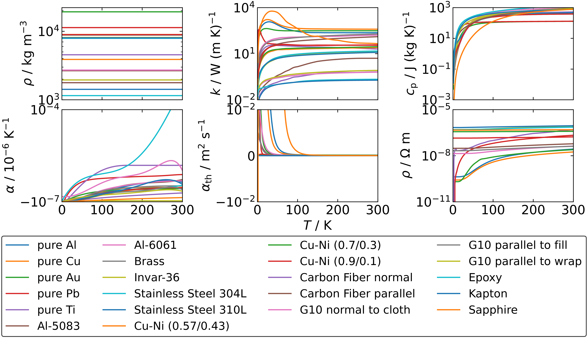

# SolidProps package for calculating the properties of solids

SolidProps is a simple library allowing to calculate the temperature-dependent properties of solids
used for the mechanical and thermal design of cooling and cryogenic systems.

The package lives here: https://github.com/JakubTk/SolidProps

This package allows calculating the following material properties of solids for temeratures from 1 to 300 K:
- density in ${\rm kg~m^{-3}}$
- thermal conductivity in ${\rm W~(m~K)^{-1}}$
- specific heat in ${\rm J~(kg~K)^{-1}}$. Note that the $c_{\rm p}=c_{\rm v}$ for incrompressible materials
- thermal expansion coefficient in ${\rm K^{-1}}$
- thermal diffusivity in ${\rm m^2~s^{-1}}$
- resistivity in ${\rm \Omega~m}$

The supported materials are listed below. The names in brackets can be used to instantiate an the class and calculate the properties of given material. The names are not case-sensitive.
- pure metals:
	- pure Aluminum (`Al`, `Aluminum`)
	- pure Copper (`Cu`, `Copper`)
	- pure Gold (`Au`, `Gold`)
	- pure Lead (`Pb`, `Lead`)
	- pure Titanium (`Ti`, `Titanium`)
- metal alloys:
	- Aluminum alloy 5083-T0 (`AL5083`)
	- Aluminum alloy 6061-T6 (`AL6061`)
	- Copper-Nickel alloy 0.57/0.43 (`COPPER-NICKEL_57-43`, `CU-NI_57-43`, `CUPRONICKEL_57-43`)
	- Copper-Nickel alloy 0.70/0.30 (`COPPER-NICKEL_70-30`, `CU-NI_70-30`, `CUPRONICKEL_70-30`)
	- Copper-Nickel alloy 0.90/0.10 (`COPPER-NICKEL_90-10`, `CU-NI_90-10`, `CUPRONICKEL_90-10`)
	- Copper-Zinc alloy 0.90/0.10 (`Brass`, `COPPER-ZINC_90-10`, `CZ-ZN_90-10`)
	- Invar-36 (`Invar`, `Invar-36`)
	- austenitic Stainless Steel 304L (`SS304L`)
	- austenitic Stainless Steel 310L (`SS310L`)
- non-metals:
	- Carbon Fiber normal to fibers (`CARBON_FIBER_NORMAL`)
	- Carbon Fiber parallel to fibers (`CARBON_FIBER_PARALLEL`)
	- Epoxy (`Epoxy`)
	- G10 normal to cloth (`G10_NORMAL_TO_CLOTH`)
	- G10 parallel to fill (`G10_PARALLEL_TO_FILL`)
	- G10 parallel to wrap (`G10_PARALLEL_TO_WRAP`)
	- Kapton (`Kapton`)
	- pure Sapphire (`Sapphire`)



## Cloning and installing the package

Clone the remote repository to local with: `git clone https://github.com/JakubTk/SolidProps`

Install the repository with:
```
cd SolidProps
python setup.py install
```

To remove the repository run: `pip uninstall SolidProps` and delete the local repository from your system.

## Using in Python

The library is a simple class with only a few methods:

`get_rhomass()` returns meterial density in ${\rm kg~m^{-3}}$  
`get_K(T)` returns thermal conductivity in ${\rm W~(m~K)^{-1}}$  
`get_cp(T)` returns specific heat in ${\rm J~(kg~K)^{-1}}$  
`get_cv(T)` returns specific heat in ${\rm J~(kg~K)^{-1}}$  
`get_thermal_expansion_coefficient(T)` returns thermal expansion coefficient in ${\rm K^{-1}}$  
`get_thermal_diffusivity(T)` returns thermal diffusivity in ${\rm m^2~s^{-1}}$  
`get_electrical_resistivity(T)` returns electrical resistivity in ${\rm \Omega~m}$

All methods but the density calculations take the absolute temperature (in Kelvins) as an input.

## Calculation time

The library is quite fast since it relies only on data interpolation. On a standard computer with i7 CPU, all the properties but the thermal diffusivity can be calculated in 15 microseconds (averaged over 100'000 caluclations). Thermal diffusivity is calculated in 38 microseconds (averaged over 100'000 caluclations).