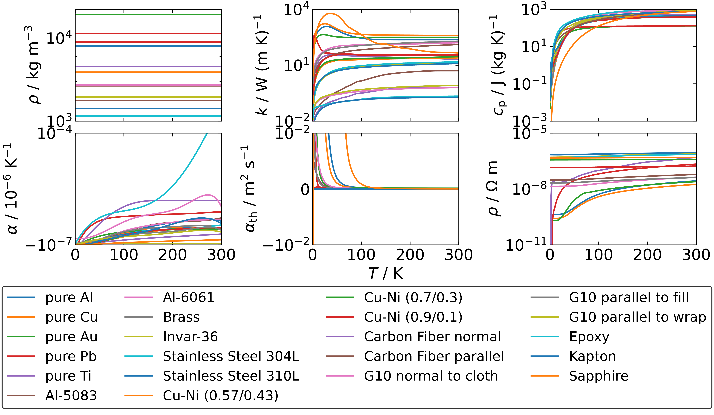

[](https://zenodo.org/badge/latestdoi/523364154)
[](https://opensource.org/licenses/MIT)

# SolidProps - calculating the properties of solids

SolidProps is a simple library allowing to calculate the temperature-dependent properties of solids
used for the mechanical and thermal design of cooling and cryogenic systems.

This package allows calculating the following material properties of solids for temperatures from 1 to 300 K:
- density in ${\rm kg~m^{-3}}$
- thermal conductivity in ${\rm W~(m~K)^{-1}}$
- specific heat in ${\rm J~(kg~K)^{-1}}$. Note that the $c_{\rm p}=c_{\rm v}$ for incompressible materials
- thermal expansion coefficient in ${\rm K^{-1}}$
- thermal diffusivity in ${\rm m^2~s^{-1}}$
- resistivity in ${\rm \Omega~m}$

## Supported materials

The names in brackets can be used to instantiate the class. The names are **not** case-sensitive.

- **pure metals:**
	- pure Aluminum (`Al`, `Aluminum`)
	- pure Copper (`Cu`, `Copper`)
	- pure Gold (`Au`, `Gold`)
	- pure Lead (`Pb`, `Lead`)
	- pure Titanium (`Ti`, `Titanium`)
- **metal alloys:**
	- Aluminum alloy 5083-T0 (`AL5083`)
	- Aluminum alloy 6061-T6 (`AL6061`)
	- Copper-Nickel alloy 0.57/0.43 (`COPPER-NICKEL_57-43`, `CU-NI_57-43`, `CUPRONICKEL_57-43`)
	- Copper-Nickel alloy 0.70/0.30 (`COPPER-NICKEL_70-30`, `CU-NI_70-30`, `CUPRONICKEL_70-30`)
	- Copper-Nickel alloy 0.90/0.10 (`COPPER-NICKEL_90-10`, `CU-NI_90-10`, `CUPRONICKEL_90-10`)
	- Copper-Zinc alloy 0.90/0.10 (`Brass`, `COPPER-ZINC_90-10`, `CZ-ZN_90-10`)
	- Invar-36 (`Invar`, `Invar-36`)
	- austenitic Stainless Steel 304L (`SS304L`)
	- austenitic Stainless Steel 310L (`SS310L`)
- **non-metals:**
	- Carbon Fiber normal to fibers (`CARBON_FIBER_NORMAL`)
	- Carbon Fiber parallel to fibers (`CARBON_FIBER_PARALLEL`)
	- Epoxy (`Epoxy`)
	- G10 normal to cloth (`G10_NORMAL_TO_CLOTH`)
	- G10 parallel to fill (`G10_PARALLEL_TO_FILL`)
	- G10 parallel to wrap (`G10_PARALLEL_TO_WRAP`)
	- Kapton (`Kapton`)
	- pure Sapphire (`Sapphire`)



## Installation

After cloning the repository, install with pip:

```bash
pip install .
```

To remove the package: `pip uninstall SolidProps`

## Tutorial

### Quick start with convenience functions

The simplest way to use SolidProps is through the module-level convenience functions.
Each function takes a material name and temperature (in Kelvin) as arguments:

```python
import SolidProps as sp

# Get thermal conductivity of Stainless Steel 304L at 290 K
k = sp.get_K('SS304L', 290)
print(f'Thermal conductivity: {k:.2f} W/(m.K)')

# Get specific heat of Copper at 80 K
cp = sp.get_cp('Cu', 80)
print(f'Specific heat: {cp:.2f} J/(kg.K)')

# Get density (temperature-independent)
rho = sp.get_rhomass('Cu')
print(f'Density: {rho:.2f} kg/m^3')
```

Available convenience functions:
- `sp.get_K(material, T)` - thermal conductivity
- `sp.get_cp(material, T)` - specific heat
- `sp.get_cv(material, T)` - specific heat at constant volume
- `sp.get_rhomass(material)` - density
- `sp.get_thermal_expansion_coefficient(material, T)` - thermal expansion coefficient
- `sp.get_thermal_diffusivity(material, T)` - thermal diffusivity
- `sp.get_electrical_resistivity(material, T)` - electrical resistivity

### Using the class directly

When querying multiple properties of the same material, creating a `SolidProps` instance
is more efficient since the data is loaded only once:

```python
from SolidProps import SolidProps

# Create an instance for a specific material
copper = SolidProps('Cu')

T = 150  # temperature in Kelvin

print(f'Density:              {copper.get_rhomass():.2f} kg/m^3')
print(f'Thermal conductivity: {copper.get_K(T):.2f} W/(m.K)')
print(f'Specific heat:        {copper.get_cp(T):.2f} J/(kg.K)')
print(f'Expansion coeff:      {copper.get_thermal_expansion_coefficient(T):.2e} 1/K')
print(f'Thermal diffusivity:  {copper.get_thermal_diffusivity(T):.2e} m^2/s')
print(f'Resistivity:          {copper.get_electrical_resistivity(T):.2e} ohm.m')
```

### Listing available materials

```python
from SolidProps import available_materials

print(available_materials())
```

### Temperature range

All temperature-dependent properties are valid for temperatures from **1 K to 300 K**.
Querying outside this range raises an error.

## API reference

| Method | Returns | Unit |
|--------|---------|------|
| `get_rhomass()` | density | kg/m^3 |
| `get_K(T)` | thermal conductivity | W/(m.K) |
| `get_cp(T)` | specific heat | J/(kg.K) |
| `get_cv(T)` | specific heat (constant volume) | J/(kg.K) |
| `get_thermal_expansion_coefficient(T)` | thermal expansion coefficient | 1/K |
| `get_thermal_diffusivity(T)` | thermal diffusivity | m^2/s |
| `get_electrical_resistivity(T)` | electrical resistivity | ohm.m |

## Calculation time

The library is fast since it relies only on data interpolation. On a standard computer with i7 CPU, all the properties but the thermal diffusivity can be calculated in 15 microseconds (averaged over 100,000 calculations). Thermal diffusivity is calculated in 38 microseconds (averaged over 100,000 calculations).
